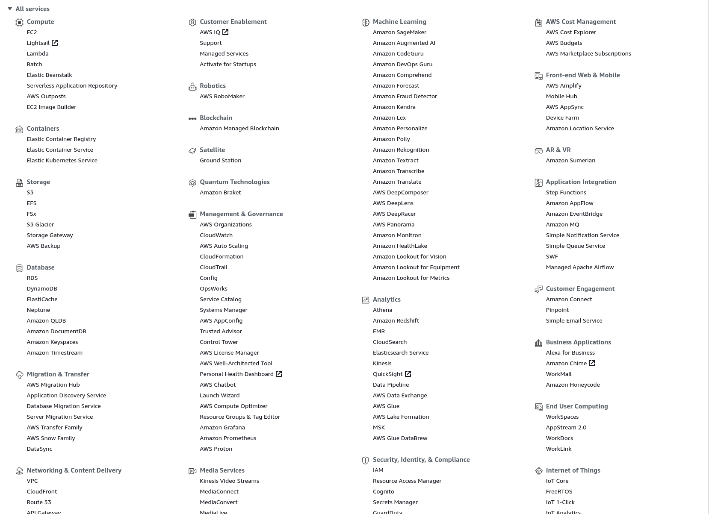
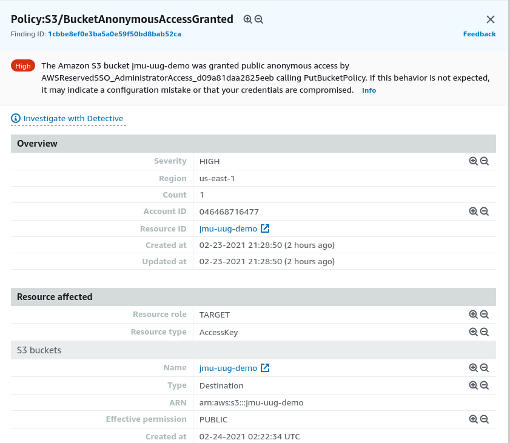
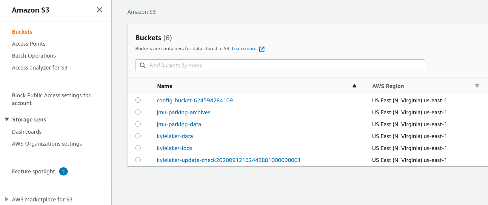

<!-- RIP to the 7x7 rule on these slides -->

# AWS Introduction

---

## Goals

- An overview of *some* important AWS services
- A look at the AWS console

## Non-Goals

- Learning everything about AWS

---

## About Me

<p style="line-height:1em">
<b>Kyle Laker</b> (<a href="https://github.com/kylelaker">@kylelaker</a>)<br>
Was: JMU CS 2019<br>
Now: <br>
</p>

I use AWS a lot but far from an expert

---

## Why the Cloud?

- Computers are expensive
- Economies of scale
- CapEx -> OpEx
- Many other buzzwords

---

## Why AWS?

- Tons of Clouds
- Azure and Google are big
- I could make a demo faster

---

## Follow Along

https://github.com/kylelaker/jmu-uug-aws-intro

Presentation: `AWS.md`
CloudFormation: `basic.yaml`

---


## Or Don't

Sign in: https://awsdemo.lakerka.com

Username: `demo-user-#` (pick a number between 1-10)
Password: `UugDemo2021` (same for all users)

Click around!

---

## Today's Services

- Compute
- Security
- Management
- Storage

Won't even scratch the surface



---

## Compute

### Traditional
- EC2 (Virtual Machines)
- ECS/EKS (Containers)

### Serverless
- Lambda (Functions)
- Fargate (Containers)

---

## Security

<style scoped>
section { columns: 2 }
</style>

**IAM**
- Control access to services & resources
- Users & groups
- Roles & policies

```json
{
    "Version": "2012-10-17",
    "Statement": [
        {
            "Action": "s3:GetBucket",
            "Effect": "Allow",
            "Resource": "arn:aws:s3:::bucket"
        },
        {
            "Action": "s3:CreateBucket",
            "Effect": "Deny",
            "Resource": "*"
        }
    ]
}
```

---

## Security

**GuardDuty**
- Monitors logs
- Reports findings
- 



---

## Management

**Infrastructure as Code**:  CloudFormation
**Audit Logs**: CloudTrail
**Logging and Graphs**: CloudWatch

---

<!-- _class: inverted -->

## Storage (S3)



- Objects stored in Buckets
- Cheap to store, more expensive to retrieve
- Block storage, NFS, Lustre are different services

---


## Getting started

1. Create an account: https://aws.amazon.com
2. Configure Multi-Factor Authentication
3. Stay within free tier
4. AWS Educate: https://aws.amazon.com/education/awseducate/

---

## Free Tier warning

- It's not totally free
- Be careful
- Some things are free forever
- Some things are expensive right away
- https://aws.amazon.com/free

---

# Questions